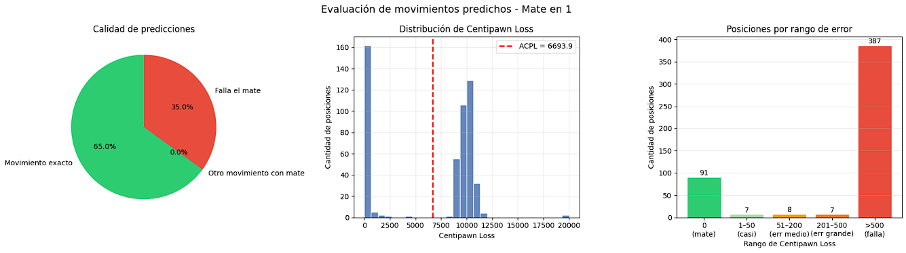

# Predictor de movimientos de ajedrez con Redes Neuronales Convolucionales

Juan Eduardo Rosas Cerón - A01710168

## Resumen

Este proyecto desarrolla un predictor del mejor movimiento de ajedrez para posiciones de jaque mate en uno, usando una Red Neuronal Convolucional (CNN). El modelo recibe una posición en formato FEN y predice los cinco movimientos, identificando el que resulta en jaque mate. El dataset se dividió en tres partes y contiene más de 850,000 posiciones únicas generadas por agentes aleatorios y obtenidas de la base de datos de lichess.

## Proyecto

El objetivo del proyecto es construir un modelo de aprendizaje profundo capaz de identificar el movimiento ganador en una posición de ajedrez dada en formato FEN. El modelo esta disenado para:

•      Recibir una posicion de tablero en formato FEN
•      Predecir los cinco mejores movimientos posibles
•      Identificar el mejor movimiento que resulta en jaque mate

La arquitectura elegida es una CNN, inspirada en el enfoque de AlphaZero (CNN + LSTM), adaptada para el análisis de posiciones estáticas sin necesidad de historial de movimientos.

### Preprocesamiento

#### Nomenglatura FEN

El formato FEN (Forsyth-Edwards Notation) codifica el estado completo de una partida. Esta conformado por seis campos separados por espacio:

> EJEMPLO:
>
> rnbqkbnr/ppppp2p/8/5pp1/4P3/8/PPPP1PPP/RNBQKBNR w KQkq - 0 3

1. Posición del tablero separado por '/'
    - Mayusculas para blancas, minusculas para negras
    - K/k para el rey
    - Q/q para la reina
    - R/r para la torre
    - N/n para el caballo
    - P/p para el peón
    - B/b para el alfil
2. De quien es el turno
    - 'w' blancas
    - 'b' negras
3. Si hay enroque
    - K enroque blanco corto
    - k enroque negro corto
    - Q enroque blanco largo
    - q enroque negro largo
    - '-' ninguno disponible
4. Captura el paso con la casilla objetiva del peón que avanzó previamente en notación algebraica
    - Por ejemplo: e6
5. Semimovimientos desde el ultimo avance de peón o captura, se usa para la regla de 50 movimientos
6. Número de la jugada

##### Representación numerica

Cada cadena FEN fue decodificada y transformada en un tensor 8x8x13:

- 8x8: Dimensiones del tablero de ajedrez
- 13 canales: 6 tipos de pieza blanca + 6 negra + 1 canal de turno

| Pieza     | Valor |
| --------- | ----- |
| Peón B    | 1     |
| Caballo B | 2     |
| Alfil B   | 3     |
| Torre B   | 4     |
| Reina B   | 5     |
| Rey B     | 6     |
| Peón N    | 7     |
| Caballo N | 8     |
| Alfil N   | 9     |
| Torre N   | 10    |
| Reina N   | 11    |
| Rey N     | 12    |

#### Normalización

Los valores de la matriz fueron normalizados al rango [-1, 1] dividiendo entre el valor máximo absoluto asignado al rey (10), garantizando que todas las entradas del modelo se encuentren en un rango uniforme.

### Modelo

Se selecciono una Red Neuronal Convolucional (CNN) por las siguientes razones:

- Las CNN son eficaces para el razonamiento espacial, como un tablero de ajedrez 8x8
- AlphaZero, es un motor de ajedrez basado en aprendizaje profundo que utiliza CNN como componente central
- Aunque AlfaZero utilice LSTM dado que el análisis es de posición es estática en mi caso no necesito el historial de movimientos

Tensor de entrada:
- 8x8 del tablero
- 6 canales para las piezas
- 1 canal adicional con el turno

#### Metricas

Durante el proceso de entrenamiento se monitorearon las curvas de accuracy y de loss, las cuales permiten saber el flujo de aprendizaje del modelo. Posteriormente, para evaluar la efectividad del modelo basándome en papers del estado del arte utilicé la métrica **Centipawn Loss (CPL)**, ampliamente empleada en el análisis de motores de ajedrez para medir la calidad de una jugada. Esta métrica permite comparar el movimiento predicho por la red neuronal contra el mejor movimiento sugerido por un motor de análisis, en este caso **Stockfish**, utilizando la librería `python-chess`.

#### ¿Qué es Centipawn Loss?

Un **centipawn** representa una centésima parte del valor de un peón. En motores de ajedrez, una ventaja de:

- +100 equivale aproximadamente a una ventaja de un peón para las blancas.
- -100 equivale a una ventaja de un peón para las negras.

El **Centipawn Loss** mide cuántos centipeones se pierden al elegir una jugada inferior respecto a la mejor disponible en la posición.

		CPL = Eval(mejor movimiento) − Eval(movimiento predicho)

Donde:

- `Eval(mejor movimiento)` es la evaluación entregada por Stockfish para la mejor jugada.
- `Eval(movimiento predicho)` es la evaluación de la jugada propuesta por el modelo.

Mientras menor sea el valor de CPL, mejor será la calidad de la predicción.

##### Interpretar resultados

| Centipawn Loss | Interpretación                |
| -------------- | ----------------------------- |
| 0 – 10         | Movimiento excelente / óptimo |
| 11 – 50        | Muy buena jugada              |
| 51 – 100       | Imprecisión menor             |
| 101 – 300      | Error considerable            |
| >300           | Grave error o blunder         |

Esto permite medir no solo si el modelo acierta exactamente el mate en uno, sino también qué tan cercana es su recomendación respecto a la mejor jugada real.

En posiciones donde existe mate forzado en un movimiento, Stockfish devuelve una evaluación de mate (`Mate in 1`). En estos casos:

- Si el modelo predice el movimiento de mate correcto, se considera **CPL = 0**.
- Si no predice el mate y selecciona otra jugada, se asigna una penalización alta, ya que omitió una victoria inmediata.

### Mejora al modelo

Como parte del desarrollo del proyecto, se implementó una mejora con el objetivo de eliminar un defecto observado. El modelo constantemente fallaba al realizar un movimiento de ajedrez valido, por lo que implemente una penalización al modelo cuando predecía movimientos ilegales.

#### Primer modelo

La primera versión consistió en una CNN entrenada únicamente para clasificar el movimiento correcto entre todas las salidas posibles (4096). Sus mejores resultados fueron:

| Métrica              | Resultado         |
| -------------------- | ----------------- |
| Movimiento exacto    | 325 / 500 (65.0%) |
| Movimientos con mate | 0 / 500 (0.0%)    |
| ACPL promedio        | 6693.9 Centipawn  |
| Mejor época          | 58                |
| Validation Loss      | 2.0054            |
| Validation Accuracy  | 53.31%            |
| Validation Top-5     | 76.99%            |

Aunque el modelo logró una precisión aceptable, presento dificultades para priorizar movimientos ganadores inmediatos y en algunos casos presentaba movimientos ilegales.

#### Segundo modelo

Para corregir este problema, se diseñó una nueva arquitectura llamada **ChessCNNWithLegalLoss**, basada en la CNN original pero incorporando una función de pérdida personalizada.

Además de la pérdida estándar de clasificación (_Sparse Categorical Crossentropy_), se agregó una penalización adicional cuando el modelo asigna probabilidad a movimientos ilegales según la posición actual del tablero.

La nueva función objetivo fue:

		Loss = CrossEntropy + IllegalProb x penalty_weight

- **CrossEntropy** evalúa si predice el movimiento correcto.
- **IllegalProb** mide la probabilidad total asignada a movimientos no legales.
- **penalty_weight** controla qué tan fuerte se castiga ese comportamiento.

Aunque no pude concluir con el entrenamiento por dificultades técnicas los resultados eran claros

|Métrica|Epoch 1|
|---|---|
|Accuracy|33.30%|
|Top-5 Accuracy|54.59%|
|Illegal Probability|0.4383|
|Loss|4.2854|

Esta modificación permite que el modelo no solo aprenda a identificar buenos movimientos, sino también a respetar las reglas del ajedrez.

## Conclusión

El desarrollo de este proyecto demuestra que es viable aplicar técnicas de aprendizaje profundo para resolver problemas dentro del ajedrez, particularmente la predicción de movimientos ganadores en posiciones de **jaque mate en uno**. Mediante el uso de una Red Neuronal Convolucional, el modelo logró aprender patrones espaciales del tablero a partir de posiciones codificadas en formato FEN. La mejora implementada mostró que agregar conocimiento y aumentar la calidad de las predicciones orientando mejor el entrenamiento del modelo.

Asimismo, el uso de métricas especializadas como **Centipawn Loss** permitió evaluar no solo si el modelo acertaba el movimiento exacto, sino también qué tan fuerte estratégicamente era la jugada propuesta respecto a la mejor recomendación de Stockfish. Esto ofrece una evaluación más realista que una simple métrica de clasificación. En comparación con proyectos avanzados como AlphaZero, este trabajo se enfocó en un problema más acotado y accesible computacionalmente, demostrando que con recursos limitados también es posible construir sistemas funcionales capaces de analizar posiciones de ajedrez mediante inteligencia artificial.

## Referencias

[1] K. Samara, A. Antreassian, M. Klug y M. S. Hasan, "Enfoques de aprendizaje automático para clasificar resultados de partidas de ajedrez: un análisis comparativo de calificaciones de jugadores y dinámicas de juego," Electronics, vol. 15, núm. 1, p. 1, 2026, doi: 10.3390/electronics15010001.

[2] M. Omori y P. Tadepalli, "Estimación de calificación de ajedrez a partir de movimientos y tiempos de reloj usando una CNN-LSTM," en Computers and Games, M. Hartisch, C.-H. Hsueh y J. Schaeffer, Eds., Lecture Notes in Computer Science, vol. 15550. Cham, Suiza: Springer, 2025, doi: 10.1007/978-3-031-86585-5_1.

[3] Anthropic, Claude, asistencia mediante IA para desarrollo de interfaz gráfica de ajedrez en Google Colab, consulta del autor, 28 de abril de 2026. [En línea]. Disponible: https://claude.ai

[4] Lichess, "Base de datos abierta de Lichess — Puzzles," database.lichess.org. [En línea]. Disponible: https://database.lichess.org/#puzzles. [Consultado: 28 de abril de 2026].

[5] Bhupen, "Mate in One (Chess)," Kaggle, 2019. [En línea]. Disponible: https://www.kaggle.com/datasets/ancientaxe/mate-in-one-chess. [Consultado: 28 de abril de 2026].

[6] R. V. Leite and A. V. C. de Oliveira, “Expected Human Performance Behavior in Chess Using Centipawn Loss Analysis,” in _HCI in Games_, X. Fang, Ed., Lecture Notes in Computer Science, vol. 14026. Cham, Switzerland: Springer, 2023, pp. 243–252. doi: 10.1007/978-3-031-35979-8_19.
